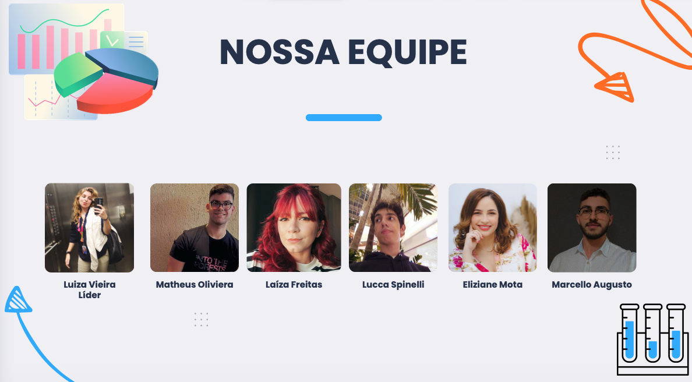

# 🧪 Projeto Final – Engenharia de Dados | Setor Farmacêutico  
## **NTT DATA + Cesar School**

---

Este projeto apresenta o desenvolvimento completo de uma solução de Engenharia de Dados aplicada ao setor farmacêutico, utilizando Databricks, Python, SQL e PySpark para ingestão, tratamento, modelagem e análise em arquitetura Lakehouse (Bronze → Silver → Gold).

---
## 🎯 Objetivo Geral
Construir um pipeline de dados robusto que permita análises operacionais do setor farmacêutico — como vendas, produção, estoque e fornecedores — por meio de dashboards analíticos e KPIs empresariais.

## 🖼️ Arquitetura da Solução  
<div align="center">
  
</div>

---

## 👥 Nossa Equipe  
<div align="center">
  
</div>

---
## 🗂️ Estrutura do Projeto

```
📁 bronze/                     # Notebooks da camada Bronze
 ├── 📑 BRONZE - CRIAÇÃO DAS TABELAS
📁 silver/                     # Notebooks da Camada Silver
 ├── 📑 LUCCA - SILVER -> PRINCÍPIOS ATIVOS
 ├── 📑 MATEUS - SILVER -> PRODUTOS FABRICADOS
 ├── 📑 LAIZA - SILVER -> VENDAS PRODUTOS FINAIS
📁 charts - kpi/               # SQLs com Views para utilizar nos Dashboards
📁 gold/                       # Notebooks da camada Gold
 ├── 📑 MARCELLO - GOLD    
```

---

## 🧱 Arquitetura da Solução

A arquitetura segue o modelo **Medallion (Bronze, Silver, Gold)**:

### **📥 Bronze — Ingestão**
- Recepção dos **3 CSVs** originais (princípios ativos, produtos fabricados e vendas).  
- Criação do **catalog setorfarmaceutico** e schemas bronze/silver/gold.  
- Conversão para **tabelas Delta** usando PySpark.  
- Dados armazenados exatamente como vieram (“raw”).  

---

### **🧼 Silver — Padronização, Limpeza e Métricas**
Etapa aprofundada para entendimento dos dados (por escolha **pedagógica**).  
Cada integrante analisou um dataset e extraiu métricas e insights.

**Principais entregas da Silver:**
- Correção de tipos e padronização de colunas.  
- Métricas agregadas por produto, fabricante, cliente e status.  
- Cálculo de KPIs (estoque médio, validade, ticket, impostos, prazos etc.).  
- Identificação dos primeiros problemas operacionais e padrões relevantes.

---

### **📊 Gold — Métricas, KPIs e Dashboards**
- Criação de **Views SQL** com indicadores consolidados das 3 tabelas.  
- Cálculo de faturamento, ranking de produtos, margens, prazos, estoque e dependências de fornecedor.  
- Construção do **Dashboard no Databricks** com filtros globais e visualizações interativas.

---

## 🧠 Principais Insights Extraídos  
### **Princípios Ativos**
- Estoque equilibrado: ~50% disponível e 50% indisponível.  
- 4 fabricantes dominam o fornecimento.  
- Diferença mínima no valor médio por fabricante → **oportunidade de negociação**.  
- Itens de maior estoque são medicamentos de alta demanda (ex.: Ibuprofeno, Paracetamol).

---

### **Produtos Fabricados**
- Dataset com **100 mil linhas** e 8 atributos.  
- Produção equilibrada entre produtos.  
- Lotes mais produtivos chegam a **1000 unidades**.  
- Validade média: **~1 ano** (alguns chegam a 2 anos).  
- Armazenamento distribuído entre Armazém 1, 2 e 3.

---

### **Vendas**
- **380 mil vendas** registradas.  
- Ticket médio: **R$ 12,5 mil**.  
- Faturamento total: **R$ 9,7 bilhões**.  
- Tipos de clientes equilibrados (farmácia, hospital, SUS, outros).  
- Produtos 343, 352 e 24 são os maiores em receita.  
- Prazo médio de pagamento: **60 dias**.  
- Imposto médio: **12,5%**.

---

## 📈 Resumo do Dashboard (Gold)
O dashboard responde três perguntas essenciais:

### **1. Estamos vendendo bem?**
- Faturamento mensal  
- Receita por produto, região e cliente  
- Margem e impacto tributário  
- Ticket médio por categoria  

### **2. Estamos produzindo na medida certa?**
- Capacidade produtiva mensal  
- Produtos mais produzidos  
- Validade dos lotes  
- Distribuição por armazém  

### **3. Temos insumos suficientes?**
- Estoque geral de princípios ativos  
- Dependência por fornecedor  
- Riscos de concentração e monopólio  

**Impactos diretos:**
- Encontrar gargalos entre produção e demanda  
- Reduzir riscos de vencimento  
- Melhorar estratégia comercial e logística  
- Priorizar produtos mais rentáveis  
- Dar suporte à tomada de decisão operacional e tática  

---

## 🛠️ Tecnologias Utilizadas
- Python 3.11+  
- Databricks Lakehouse  
- Apache Spark / PySpark  
- Delta Lake  
- SQL (Databricks SQL / Views)  

---

## 👥 Equipe
Projeto desenvolvido pelos estudantes da **Cesar School**, em parceria com a **NTT DATA**:

- **Luiza Vieira - Líder** · [LinkedIn](https://www.linkedin.com/in/vbluuiza)
- **Marcello Augusto** · [LinkedIn](https://www.linkedin.com/in/marcelloaugustosv/)
- **Mateus Oliveira** · [Github](https://github.com/mateusoliveiraadev)
- **Lucca Spinelli** · [LinkedIn](https://www.linkedin.com/in/lucca-spinelli-a65672240/)
- **Eliziane Mota** · [LinkedIn](https://www.linkedin.com/in/eliziane-mota/)
- **Laíza Freitas** · [LinkedIn](https://www.linkedin.com/in/laizafreitas/)

